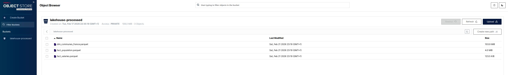
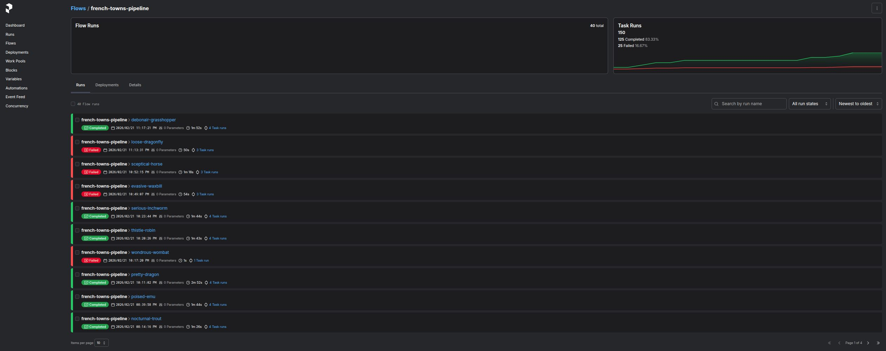
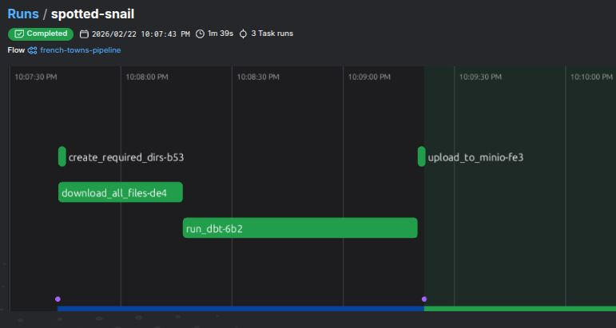

# French Towns LakeHouse

- [French Towns LakeHouse](#french-towns-lakehouse)
  - [What does this build?](#what-does-this-build)
  - [Technology Stack](#technology-stack)
  - [Prerequisites](#prerequisites)
  - [Setup](#setup)
  - [Start the MinIO Server](#start-the-minio-server)
  - [Run the Pipeline](#run-the-pipeline)
    - [What the Pipeline Does](#what-the-pipeline-does)
    - [Run dbt in isolation](#run-dbt-in-isolation)
  - [Query the Lakehouse](#query-the-lakehouse)
  - [Project Structure](#project-structure)
  - [Data Sources](#data-sources)
  - [dbt Documentation](#dbt-documentation)


A self-hosted data lakehouse of French municipal data. The pipeline downloads open government datasets, transforms them into clean Parquet files using DuckDB and dbt, and uploads the results to a local MinIO object store.

**dbt model documentation:** [https://enarroied.github.io/french_towns_lakehouse/](https://enarroied.github.io/french_towns_lakehouse/)

---

## What does this build?

This project is about creating a data lakehouse using French geographical data. As an example, we created three analytics-ready tables, available as Parquet files in an S3-compatible object store (refer to the DBT documentation to see all the tables and their lineage):

- `dim_communes_france` : all French communes with geometry, administrative hierarchy, spatial metrics, and flag columns (Corsica, metropole, prefecture status)
- `fact_population` : historical population per commune by census year
- `fact_salaries` : mean annual salary by sex per commune (2023)

All three tables join on the INSEE commune code (`id`, `CHAR(5)`).

**Note**: INSEE codes include letters and always have 5 characters, we chose a `CHAR(5)` for now, we may create a `INT` id sometime.

---

## Technology Stack

| Layer | Tool | Role |
|---|---|---|
| Orchestration | Prefect 3 | Flow and task management |
| Downloading | httpx (async) | Concurrent file downloads |
| Transformation | dbt-core + dbt-duckdb | SQL models, external Parquet output |
| Compute engine | DuckDB | In-process SQL, spatial queries |
| Object storage | MinIO (Docker) | S3-compatible local lakehouse store |
| Package manager | uv | Python dependency management |

**Why DuckDB?** DuckDB runs entirely in-process. It doesn't need a server. It reads GeoJSON, CSV, and Parquet natively, supports spatial functions via the `spatial` extension, and handles the full transformation workload on a laptop. For a dataset of this size, it outperforms a traditional database stack with a fraction of the operational complexity.

**Why dbt?** dbt brings software engineering discipline to SQL: version control, modular models, schema documentation, and data tests. The schema YAML files define column types, accepted value ranges, uniqueness constraints, and referential integrity checks between the dimension and fact tables. The [dbt docs site](https://enarroied.github.io/french_towns_lakehouse/) auto-generates from those files on every push to master.

---

## Prerequisites

- Python 3.11+
- [uv](https://docs.astral.sh/uv/) (`pip install uv`)
- Docker and Docker Compose

---

## Setup

Clone the repository and install dependencies:

```bash
git clone https://github.com/enarroied/french_towns_lakehouse.git
cd french_towns_lakehouse
uv sync
```

Install dbt packages:

```bash
cd french_towns_dbt
dbt deps
cd ..
```

Create a `.env` file at the project root:

```bash
MINIO_ENDPOINT=http://localhost:19000
MINIO_ROOT_USER=minioadmin
MINIO_ROOT_PASSWORD=minioadmin
```

---

## Start the MinIO Server

MinIO provides the S3-compatible object store where the pipeline deposits finished Parquet files. Run it in a separate terminal before starting the pipeline:

```bash
docker compose up -d
```

This starts MinIO with:

- **API endpoint:** `http://localhost:19000`
- **Web console:** `http://localhost:19001` (login: `minioadmin` / `minioadmin`)
- **Data volume:** `./data/minio` (persists across restarts)

You can access your MinIO service from your browser:



The pipeline creates the `lakehouse-processed` bucket automatically on first run. You can browse uploaded files in the web console or query them directly via the S3 API.

To stop MinIO:

```bash
docker compose down
```

---

## Run the Pipeline

Before running the pipeline, ensure MinIO is running as well.

You'll need Prefect's serve to run to run the pipeline. To start it, you need to open a dedicated terminal session and type:

```bash
uv run prefect server start
```

Prefect starts a local server at `http://localhost:4200` where you can monitor task progress, view logs, and inspect run history.



Next, you can start the pipeline from the project root:

```bash
uv run python -m flows.french_towns_pipeline
```

You can see the tasks running in Prefect's UI.



### What the Pipeline Does

**Step 1 — Create directories.** Creates `input/`, `data/processed/`, and other required paths from `config.yaml` if they do not exist.

**Step 2 — Download source files.** Downloads raw datasets from French government APIs (or other sources) and data portals concurrently, using an asyncio semaphore to cap concurrency at three simultaneous requests. ZIP archives extract automatically to `input/`; plain files move there directly. INSEE APIs can be slow — the timeout is set to 120 seconds per file.

Example of downloaded files:

- `communes_france.geojson` (287 MB) — GeoJSON of all French communes
- `arrondissements.csv` — INSEE arrondissement reference table
- `departements.csv` — INSEE department reference table
- `DS_POPULATIONS_HISTORIQUES_data.csv` — historical population per commune (from ZIP)
- `DS_BTS_SAL_EQTP_SEX_PCS_2023_data.csv` — salary data by sex and employment category (from ZIP)

**Step 3 — dbt run.** Prefect calls `dbt run` as a subprocess from inside `french_towns_dbt/`. dbt stages external sources (mounting the raw files as DuckDB views), then runs all three models in parallel across four threads. Each model writes a Parquet file to `data/processed/`.

**Step 4 — Upload to MinIO.** All `*.parquet` files from `data/processed/` upload to the `lakehouse-processed` bucket. The pipeline creates the bucket if it does not exist.

### Run dbt in isolation

To iterate on models without re-downloading source files:

```bash
cd french_towns_dbt
dbt run --profiles-dir .
```

To run data quality tests:

```bash
dbt test --profiles-dir .
```

---

## Query the Lakehouse

Once the pipeline completes, query the Parquet files directly from DuckDB using the MinIO S3 endpoint:

```sql
INSTALL httpfs;
LOAD httpfs;

SET s3_endpoint = 'localhost:19000';
SET s3_access_key_id = 'minioadmin';
SET s3_secret_access_key = 'minioadmin';
SET s3_use_ssl = false;
SET s3_url_style = 'path';

-- Top 10 communes by population in 2021
SELECT
    c.name,
    c.department_name,
    p.population
FROM read_parquet('s3://lakehouse-processed/dim_communes_france.parquet') AS c
JOIN read_parquet('s3://lakehouse-processed/fact_population.parquet') AS p
    ON c.id = p.id
WHERE p.year = 2021
ORDER BY p.population DESC
LIMIT 10;
```

```sql
-- Gender pay gap by region (2023)
SELECT
    c.region_name,
    ROUND(AVG(s.mean_salary_men)) AS avg_salary_men,
    ROUND(AVG(s.mean_salary_women)) AS avg_salary_women,
    ROUND(100.0 * (AVG(s.mean_salary_men) - AVG(s.mean_salary_women)) / AVG(s.mean_salary_men), 1) AS gap_pct
FROM read_parquet('s3://lakehouse-processed/dim_communes_france.parquet') AS c
JOIN read_parquet('s3://lakehouse-processed/fact_salaries.parquet') AS s
    ON c.id = s.id
WHERE c.flag_metropole = 1
GROUP BY c.region_name
ORDER BY gap_pct DESC;
```

---

## Project Structure

```
french_towns_lakehouse/
├── flows/
│   └── french_towns_pipeline.py     # Prefect orchestration flow
├── scripts/
│   └── download.py                  # Async file downloader
├── french_towns_dbt/                # dbt project
│   ├── dbt_project.yml
│   ├── profiles.yml
│   ├── packages.yml
│   └── models/
│       ├── sources.yml
│       ├── dim_communes_france.sql
│       ├── fact_population.sql
│       └── fact_salaries.sql
├── .github/
│   └── workflows/
│       └── deploy_docs.yml          # Auto-deploys dbt docs to GitHub Pages
├── input/                           # Downloaded raw files (gitignored)
├── data/
│   ├── processed/                   # dbt Parquet outputs (gitignored)
│   └── minio/                       # MinIO volume (gitignored)
├── config.yaml
├── docker-compose.yml
└── pyproject.toml
```

---

## Data Sources

| Dataset | Source | License |
|---|---|---|
| Communes GeoJSON | [data.gouv.fr](https://www.data.gouv.fr/datasets/communes-france-1) | Licence Ouverte 2.0 |
| Arrondissements & Departments | [INSEE](https://www.insee.fr) | Licence Ouverte 2.0 |
| Historical populations | [INSEE](https://catalogue-donnees.insee.fr/fr/catalogue/recherche/DS_POPULATIONS_HISTORIQUES) | Licence Ouverte 2.0 |
| Salaries by sex and professional category | [INSEE](https://catalogue-donnees.insee.fr/fr/catalogue/recherche/DS_BTS_SAL_EQTP_SEX_PCS) | Licence Ouverte 2.0 |

---

## dbt Documentation

The dbt docs site generates automatically on every push to `master` via GitHub Actions and deploys to GitHub Pages. To generate docs locally:

```bash
cd french_towns_dbt
dbt docs generate --profiles-dir .
dbt docs serve --profiles-dir .
```

Open `http://localhost:8080` to browse the full data catalog, lineage graph, and column-level documentation.

For more on dbt, see the [official dbt documentation](https://docs.getdbt.com).
